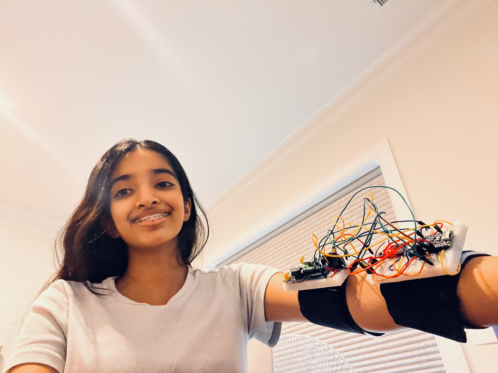
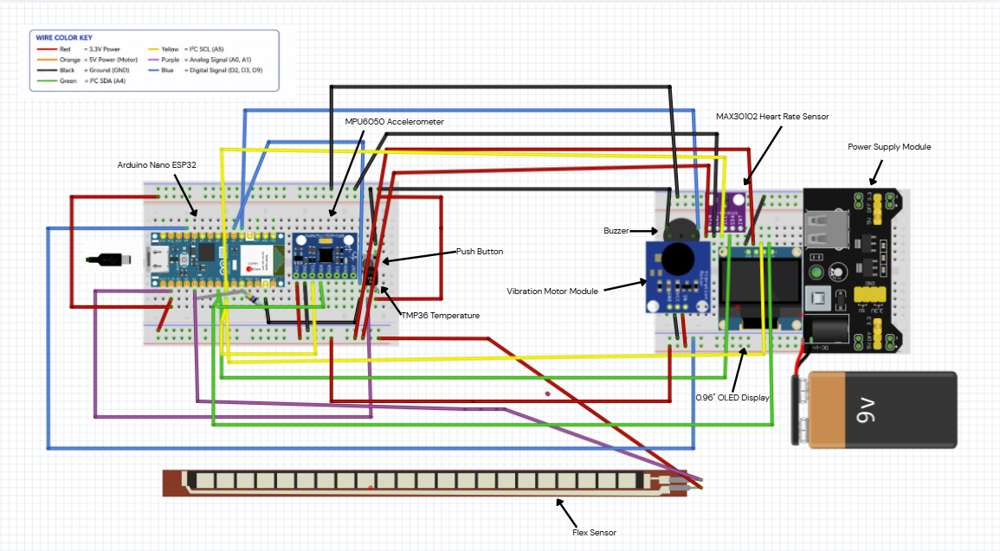
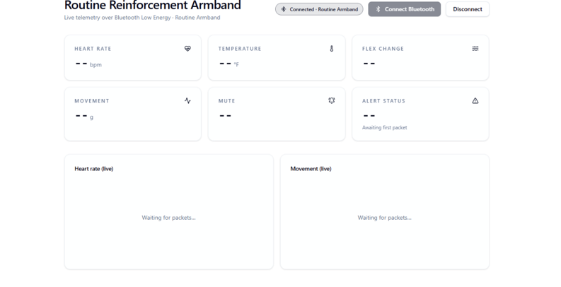

# Routine Reinforcement Armband
This project features an armband that uses an Arduino Nano ESP32 to perform routine correspondence by monitoring an individual's movement and temperature while giving instructions through a buzzer and vibration motor. Moreover, I added various sensors, such as a flex sensor to measure arm bending, a heart-rate detector to measure beats per minute, and an OLED display to show all measurements on the device. Additional improvements involve rearranging the components on two breadboards linked together, which makes the armband feasible to wear. Finally, I designed a website to display live readings, alert conditions, and heart-rate and movement graphs by connecting to the controllers via Bluetooth Low Energy. 

| Engineer | School | Area of Interest | Grade |
| --- | --- | --- | --- |
| Mohisha P | Aberdeen High School | Biomedical Engineering | Incoming Sophomore |

<p align="center">
  <a href="routine-armband.jpeg">
    
  </a>
</p>

<p align="center"><em>Completed Routine Reinforcement Armband</em></p>


# Final Milestone


<iframe width="560" height="315" src="https://www.youtube.com/embed/qgViM-uNFv4?start=8" title="Milestone 3 - Routine Reinforcement Armband" frameborder="0" allow="accelerometer; autoplay; clipboard-write; encrypted-media; gyroscope; picture-in-picture; web-share" referrerpolicy="strict-origin-when-cross-origin" allowfullscreen></iframe>

After my last milestone, I have made several changes to the Routine Reinforcement Armband. I divided the circuit among two breadboards, added a flex sensor, heart-rate sensor, and OLED display, and created a website to collect real-time sensor data through Bluetooth Low Energy.


The most difficult part was making sure that all parts would work together properly. I had many problems troubleshooting wiring, sensor connections, the power supply, and Bluetooth communication. I consider my biggest achievement to be integrating the hardware, Arduino programming, Bluetooth connectivity, and the website into one working system.


While working on the BSE project, I learned more about circuit design, Arduino programming, connecting analog and digital sensors, and debugging. I also learned about Bluetooth Low Energy services and characteristics and how they can be used to send sensor data wirelessly.


In the future, I would like to make the armband smaller and more “wearable” by replacing the breadboards with a permanent circuit, adding a battery charger, improving sensor accuracy, and creating a better website that can store and analyze the data over time. 


# Second Milestone

<iframe width="560" height="315" src="https://www.youtube.com/embed/tu1wzGVcvsc" title="Milestone 2 - Routine Reinforcement Armband" frameborder="0" allow="accelerometer; autoplay; clipboard-write; encrypted-media; gyroscope; picture-in-picture; web-share" referrerpolicy="strict-origin-when-cross-origin" allowfullscreen></iframe>

Ever since I achieved my initial milestone, I have dedicated my time and efforts to completing the foundation of my Routine Reinforcement Armband. I wired and programmed the main components of the armband, namely the MPU6050 movement sensor, TMP36 temperature sensor, buzzer, vibration motor, and mute button. Not only did I implement the wiring, but I also made sure that the armband is able to calibrate and set alert thresholds, which allow it to detect movement and temperature variations.

Perhaps one of the most unexpected aspects of this stage was the technical difficulties I had to overcome to achieve smooth, correct functioning of all components at the same time. It turned out that I had to troubleshoot wiring, check the performance of each individual sensor, calibrate thresholds, and check the efficiency of the motor and buzzer.


Combining sensors and outputs to operate together in a single system was one of the toughest challenges faced at this stage. Each element was capable of working independently, but connecting the different elements required changing the wiring and coding to ensure simultaneous operation without any conflicts. 

In the future, I still have to make the armband more wearable, together with all the modifications to my idea.

# First Milestone


<iframe width="560" height="315" src="https://www.youtube.com/embed/2T25-TxnDEk?si=ZgSz9lrB-076J5-b" title="YouTube video player" frameborder="0" allow="accelerometer; autoplay; clipboard-write; encrypted-media; gyroscope; picture-in-picture; web-share" referrerpolicy="strict-origin-when-cross-origin" allowfullscreen></iframe>

My project involves the development of a Routine Reinforcement Armband which is intended to monitor a person's movements, body temperature, and to send alerts via vibration. The Arduino ESP32 functions as the device's central unit by gathering data from the accelerometer, the temperature sensor, and managing the vibration motor. In my first milestone, I tested each of the components individually before putting them all together. 

To begin with, I connected the ESP32 to my computer and uploaded a program which makes an LED blink in order to check that the device was functioning. Next, I tested the vibration motor by writing a program to switch it on and off, checked the accelerometer by observing how its X, Y ,and Z values changed when the device was moved, and tested the temperature sensor by viewing its readings in the Serial Monitor. 

A difficulty that I encountered was ensuring that the wiring, the pins, the board settings, and the Arduino libraries were all correct. For my next milestone, I intend to combine the sensors so that an alert is triggered if there is movement detected. Later on, I plan to connect the armband to Wi-Fi, set up a website to show the data it collects, as well as design the complete system into a wearable form.

# Schematics 
<p align="center">
  <a href="routine-armband-schematic.png">
    
  </a>
</p>

<p align="center"><em>Click the schematic to view it at full size.</em></p>

# Code


```c++
<h2>Final Arduino Code</h2>

<details>
<summary><strong>Click to view full Arduino code</strong></summary>

<div style="max-height:500px; overflow:auto; border:1px solid #ccc; padding:15px; margin-top:10px; border-radius:8px; background-color:#f6f8fa;">
<pre><code>
Yep — here is the full final Arduino code for the entire Routine Reinforcement Armband, including the OLED, MPU6050, TMP36, flex sensor, heart-rate sensor, buzzer, vibration motor, mute button, USB Serial output, and Bluetooth Low Energy connection to your website.

#include <Wire.h>

#include <Adafruit_GFX.h>
#include <Adafruit_SSD1306.h>

#include "MAX30105.h"
#include "heartRate.h"

#include <BLEDevice.h>
#include <BLEServer.h>
#include <BLEUtils.h>
#include <BLE2902.h>

// =====================================================
// PINS
// =====================================================

const int motorPin = D9;
const int buzzerPin = D2;
const int buttonPin = D3;

const int tempPin = A0;
const int flexPin = A1;

// I2C:
// SDA = A4
// SCL = A5

// =====================================================
// OLED
// =====================================================

#define SCREEN_WIDTH 128
#define SCREEN_HEIGHT 64
#define OLED_RESET -1
#define OLED_ADDRESS 0x3C

Adafruit_SSD1306 display(
  SCREEN_WIDTH,
  SCREEN_HEIGHT,
  &Wire,
  OLED_RESET
);

bool oledFound = false;

// =====================================================
// BUZZER
// =====================================================

const int buzzerChannel = 0;

// =====================================================
// MPU6050
// =====================================================

const int MPU_ADDR = 0x68;

bool accelerometerFound = false;

int16_t baselineX = 0;
int16_t baselineY = 0;
int16_t baselineZ = 0;

float movementLevel = 0.0;

const float movementDisplayThreshold = 0.20;
const float motionAlertThreshold = 0.90;

bool isMoving = false;
bool motionAlert = false;

unsigned long lastMovementTime = 0;

const unsigned long restingDelay = 5000;

// =====================================================
// TEMPERATURE
// =====================================================

float currentTempF = 0.0;

const float lowTempF = 59.0;
const float highTempF = 104.0;

bool temperatureAlert = false;

// =====================================================
// FLEX SENSOR
// =====================================================

int flexBaseline = 0;
int currentFlexReading = 0;
int currentFlexChange = 0;

const int flexDeltaThreshold = 200;

bool flexAlert = false;

// =====================================================
// HEART-RATE SENSOR
// =====================================================

MAX30105 heartSensor;

bool heartSensorFound = false;
bool fingerDetected = false;

long infraredReading = 0;

// Lower this if your finger is not detected.
// Raise it if it detects a finger when nothing is there.
const long fingerDetectionThreshold = 10000;

const byte RATE_SIZE = 4;

byte bpmReadings[RATE_SIZE];

byte readingPosition = 0;
byte readingsCollected = 0;

unsigned long previousBeatTime = 0;
unsigned long lastValidBeatTime = 0;

float currentBPM = 0.0;
int averageBPM = 0;

// Prototype thresholds only
const int lowHeartRateBPM = 60;
const int highHeartRateBPM = 100;

bool heartRateAlert = false;
bool heartRateLow = false;
bool heartRateHigh = false;

// =====================================================
// MUTE BUTTON
// =====================================================

bool alertsMuted = false;
bool previousButtonState = HIGH;

// =====================================================
// BLUETOOTH LOW ENERGY
// =====================================================

#define BLE_SERVICE_UUID \
"7e400001-b5a3-f393-e0a9-e50e24dcca9e"

#define BLE_DATA_UUID \
"7e400003-b5a3-f393-e0a9-e50e24dcca9e"

BLEServer* bleServer = nullptr;
BLECharacteristic* bleDataCharacteristic = nullptr;

bool bluetoothConnected = false;
bool previouslyBluetoothConnected = false;

class ArmbandServerCallbacks : public BLEServerCallbacks {

  void onConnect(BLEServer* server) {
    bluetoothConnected = true;
  }

  void onDisconnect(BLEServer* server) {
    bluetoothConnected = false;
  }
};

// =====================================================
// TIMERS
// =====================================================

unsigned long previousMotionCheck = 0;
unsigned long previousTemperatureCheck = 0;
unsigned long previousFlexCheck = 0;
unsigned long previousOLEDUpdate = 0;
unsigned long previousDataUpdate = 0;

const unsigned long motionInterval = 20;
const unsigned long temperatureInterval = 500;
const unsigned long flexInterval = 50;
const unsigned long oledInterval = 250;
const unsigned long dataInterval = 500;

// =====================================================
// SETUP
// =====================================================

void setup() {

  Serial.begin(115200);

  delay(1000);

  pinMode(motorPin, OUTPUT);
  pinMode(buttonPin, INPUT_PULLUP);

  digitalWrite(motorPin, LOW);

  // Passive buzzer
  ledcSetup(
    buzzerChannel,
    2000,
    8
  );

  ledcAttachPin(
    buzzerPin,
    buzzerChannel
  );

  buzzerOff();

  analogReadResolution(12);

  Wire.begin();
  Wire.setClock(400000);

  Serial.println();
  Serial.println(
    "Routine Reinforcement Armband starting..."
  );

  Serial.println(
    "Keep arm still and flex sensor straight."
  );

  setupOLED();

  setupMPU6050();

  setupHeartSensor();

  calibrateFlexSensor();

  setupBluetooth();

  lastMovementTime = millis();

  Serial.println("Armband ready.");

  showStartupComplete();
}

// =====================================================
// LOOP
// =====================================================

void loop() {

  unsigned long currentTime = millis();

  // Heart-rate sensor needs frequent checking
  checkHeartRate();

  // Button
  if (buttonPressed()) {

    alertsMuted = !alertsMuted;

    stopOutputs();

    if (alertsMuted) {
      Serial.println("Alerts muted.");
    }
    else {
      Serial.println("Alerts unmuted.");
    }
  }

  // Movement
  if (
    currentTime - previousMotionCheck
    >= motionInterval
  ) {

    previousMotionCheck = currentTime;

    checkMovement();
  }

  // Temperature
  if (
    currentTime - previousTemperatureCheck
    >= temperatureInterval
  ) {

    previousTemperatureCheck =
      currentTime;

    checkTemperature();
  }

  // Flex
  if (
    currentTime - previousFlexCheck
    >= flexInterval
  ) {

    previousFlexCheck =
      currentTime;

    checkFlexSensor();
  }

  updateHeartRateAlert();

  updateAlertOutputs();

  manageBluetoothConnection();

  // OLED
  if (
    currentTime - previousOLEDUpdate
    >= oledInterval
  ) {

    previousOLEDUpdate =
      currentTime;

    updateOLED();
  }

  // Send website data
  if (
    currentTime - previousDataUpdate
    >= dataInterval
  ) {

    previousDataUpdate =
      currentTime;

    printWebsiteData();

    sendBluetoothData();
  }
}

// =====================================================
// OLED SETUP
// =====================================================

void setupOLED() {

  oledFound =
    display.begin(
      SSD1306_SWITCHCAPVCC,
      OLED_ADDRESS
    );

  if (!oledFound) {

    Serial.println(
      "OLED not detected."
    );

    return;
  }

  Serial.println(
    "OLED detected."
  );

  display.clearDisplay();

  display.setTextColor(
    SSD1306_WHITE
  );

  display.setTextSize(1);

  display.setCursor(0, 0);
  display.println(
    "ROUTINE ARMBAND"
  );

  display.setCursor(0, 20);
  display.println(
    "Starting sensors..."
  );

  display.setCursor(0, 38);
  display.println(
    "Keep arm still."
  );

  display.display();
}

// =====================================================
// MPU6050 SETUP
// =====================================================

void setupMPU6050() {

  Wire.beginTransmission(
    MPU_ADDR
  );

  byte error =
    Wire.endTransmission();

  if (error != 0) {

    accelerometerFound = false;

    Serial.println(
      "MPU6050 not detected."
    );

    return;
  }

  accelerometerFound = true;

  // Wake MPU6050
  Wire.beginTransmission(
    MPU_ADDR
  );

  Wire.write(0x6B);
  Wire.write(0);

  Wire.endTransmission();

  delay(300);

  calibrateMovementSensor();

  Serial.println(
    "MPU6050 detected."
  );
}

// =====================================================
// HEART-RATE SENSOR SETUP
// =====================================================

void setupHeartSensor() {

  if (
    !heartSensor.begin(
      Wire,
      I2C_SPEED_FAST
    )
  ) {

    heartSensorFound = false;

    Serial.println(
      "Heart-rate sensor not detected."
    );

    return;
  }

  heartSensorFound = true;

  byte ledBrightness = 31;
  byte sampleAverage = 4;
  byte ledMode = 2;

  int sampleRate = 100;
  int pulseWidth = 411;
  int adcRange = 4096;

  heartSensor.setup(
    ledBrightness,
    sampleAverage,
    ledMode,
    sampleRate,
    pulseWidth,
    adcRange
  );

  heartSensor.setPulseAmplitudeRed(
    0x1F
  );

  heartSensor.setPulseAmplitudeIR(
    0x1F
  );

  heartSensor.setPulseAmplitudeGreen(
    0
  );

  Serial.println(
    "Heart-rate sensor detected."
  );
}

// =====================================================
// BLUETOOTH SETUP
// =====================================================

void setupBluetooth() {

  BLEDevice::init(
    "Routine Armband"
  );

  bleServer =
    BLEDevice::createServer();

  bleServer->setCallbacks(
    new ArmbandServerCallbacks()
  );

  BLEService* armbandService =
    bleServer->createService(
      BLE_SERVICE_UUID
    );

  bleDataCharacteristic =
    armbandService
      ->createCharacteristic(
        BLE_DATA_UUID,

        BLECharacteristic::PROPERTY_READ |
        BLECharacteristic::PROPERTY_NOTIFY
      );

  bleDataCharacteristic
    ->addDescriptor(
      new BLE2902()
    );

  bleDataCharacteristic
    ->setValue(
      "Armband ready"
    );

  armbandService->start();

  BLEAdvertising* advertising =
    BLEDevice::getAdvertising();

  advertising->addServiceUUID(
    BLE_SERVICE_UUID
  );

  advertising->setScanResponse(
    true
  );

  advertising->start();

  Serial.println(
    "Bluetooth started."
  );

  Serial.println(
    "Device: Routine Armband"
  );
}

// =====================================================
// BLUETOOTH CONNECTION
// =====================================================

void manageBluetoothConnection() {

  if (
    !bluetoothConnected &&
    previouslyBluetoothConnected
  ) {

    delay(100);

    if (bleServer != nullptr) {

      bleServer
        ->startAdvertising();
    }

    previouslyBluetoothConnected =
      false;

    Serial.println(
      "Bluetooth disconnected."
    );
  }

  if (
    bluetoothConnected &&
    !previouslyBluetoothConnected
  ) {

    previouslyBluetoothConnected =
      true;

    Serial.println(
      "Bluetooth connected."
    );
  }
}

// =====================================================
// START SCREEN
// =====================================================

void showStartupComplete() {

  if (!oledFound) {
    return;
  }

  display.clearDisplay();

  display.setTextColor(
    SSD1306_WHITE
  );

  display.setTextSize(1);

  display.setCursor(0, 8);

  display.println(
    "CALIBRATION COMPLETE"
  );

  display.setCursor(0, 27);

  display.println(
    "Armband ready!"
  );

  display.setCursor(0, 44);

  display.println(
    "Place finger on HR."
  );

  display.display();

  delay(1000);
}

// =====================================================
// HEART RATE
// =====================================================

void checkHeartRate() {

  if (!heartSensorFound) {

    fingerDetected = false;

    return;
  }

  infraredReading =
    heartSensor.getIR();

  bool newFingerDetected =
    infraredReading >=
    fingerDetectionThreshold;

  if (!newFingerDetected) {

    if (fingerDetected) {

      resetHeartRateReadings();
    }

    fingerDetected = false;

    return;
  }

  fingerDetected = true;

  if (
    checkForBeat(
      infraredReading
    )
  ) {

    unsigned long currentBeatTime =
      millis();

    if (previousBeatTime > 0) {

      unsigned long
      timeBetweenBeats =

        currentBeatTime -
        previousBeatTime;

      float calculatedBPM =

        60.0 /
        (
          timeBetweenBeats /
          1000.0
        );

      if (
        calculatedBPM >= 30 &&
        calculatedBPM <= 220
      ) {

        currentBPM =
          calculatedBPM;

        lastValidBeatTime =
          currentBeatTime;

        bpmReadings[
          readingPosition
        ] =
          (byte)currentBPM;

        readingPosition++;

        readingPosition %=
          RATE_SIZE;

        if (
          readingsCollected <
          RATE_SIZE
        ) {

          readingsCollected++;
        }

        int totalBPM = 0;

        for (
          byte i = 0;
          i < readingsCollected;
          i++
        ) {

          totalBPM +=
            bpmReadings[i];
        }

        averageBPM =
          totalBPM /
          readingsCollected;
      }
    }

    previousBeatTime =
      currentBeatTime;
  }

  // Clear stale BPM
  if (
    lastValidBeatTime > 0 &&
    millis() -
      lastValidBeatTime >
      3000
  ) {

    resetHeartRateReadings();

    fingerDetected = true;
  }
}

// =====================================================
// RESET HEART RATE
// =====================================================

void resetHeartRateReadings() {

  currentBPM = 0;

  averageBPM = 0;

  previousBeatTime = 0;

  lastValidBeatTime = 0;

  readingPosition = 0;

  readingsCollected = 0;

  heartRateAlert = false;

  heartRateLow = false;

  heartRateHigh = false;

  for (
    byte i = 0;
    i < RATE_SIZE;
    i++
  ) {

    bpmReadings[i] = 0;
  }
}

// =====================================================
// HEART-RATE ALERT
// =====================================================

void updateHeartRateAlert() {

  bool restingLongEnough =

    millis() -
    lastMovementTime >=
    restingDelay;

  bool validHeartReading =

    heartSensorFound &&
    fingerDetected &&
    readingsCollected >= 3 &&
    averageBPM > 0;

  heartRateLow = false;

  heartRateHigh = false;

  heartRateAlert = false;

  if (
    !validHeartReading ||
    !restingLongEnough
  ) {

    return;
  }

  if (
    averageBPM <
    lowHeartRateBPM
  ) {

    heartRateLow = true;

    heartRateAlert = true;
  }

  if (
    averageBPM >
    highHeartRateBPM
  ) {

    heartRateHigh = true;

    heartRateAlert = true;
  }
}

// =====================================================
// MOVEMENT CALIBRATION
// =====================================================

void calibrateMovementSensor() {

  long totalX = 0;
  long totalY = 0;
  long totalZ = 0;

  const int samples = 50;

  int successfulSamples = 0;

  for (
    int i = 0;
    i < samples;
    i++
  ) {

    int16_t x;
    int16_t y;
    int16_t z;

    if (
      readAccelerometer(
        x,
        y,
        z
      )
    ) {

      totalX += x;
      totalY += y;
      totalZ += z;

      successfulSamples++;
    }

    delay(20);
  }

  if (
    successfulSamples > 0
  ) {

    baselineX =
      totalX /
      successfulSamples;

    baselineY =
      totalY /
      successfulSamples;

    baselineZ =
      totalZ /
      successfulSamples;
  }
}

// =====================================================
// MOVEMENT CHECK
// =====================================================

void checkMovement() {

  if (!accelerometerFound) {

    movementLevel = 0;

    isMoving = false;

    motionAlert = false;

    return;
  }

  int16_t x;
  int16_t y;
  int16_t z;

  if (
    !readAccelerometer(
      x,
      y,
      z
    )
  ) {

    return;
  }

  long differenceX =
    abs(
      (long)x -
      baselineX
    );

  long differenceY =
    abs(
      (long)y -
      baselineY
    );

  long differenceZ =
    abs(
      (long)z -
      baselineZ
    );

  long totalMovement =

    differenceX +
    differenceY +
    differenceZ;

  movementLevel =

    totalMovement /
    16384.0;

  isMoving =

    movementLevel >
    movementDisplayThreshold;

  motionAlert =

    movementLevel >
    motionAlertThreshold;

  if (isMoving) {

    lastMovementTime =
      millis();
  }
}

// =====================================================
// READ MPU6050
// =====================================================

bool readAccelerometer(
  int16_t& x,
  int16_t& y,
  int16_t& z
) {

  Wire.beginTransmission(
    MPU_ADDR
  );

  Wire.write(0x3B);

  if (
    Wire.endTransmission(
      false
    ) != 0
  ) {

    return false;
  }

  Wire.requestFrom(
    MPU_ADDR,
    6,
    true
  );

  if (
    Wire.available() < 6
  ) {

    return false;
  }

  x =
    (Wire.read() << 8) |
    Wire.read();

  y =
    (Wire.read() << 8) |
    Wire.read();

  z =
    (Wire.read() << 8) |
    Wire.read();

  return true;
}

// =====================================================
// TEMPERATURE
// =====================================================

void checkTemperature() {

  uint32_t totalMillivolts = 0;

  const int samples = 10;

  for (
    int i = 0;
    i < samples;
    i++
  ) {

    totalMillivolts +=

      analogReadMilliVolts(
        tempPin
      );
  }

  float voltageMillivolts =

    totalMillivolts /
    float(samples);

  float tempC =

    (
      voltageMillivolts -
      500.0
    ) /
    10.0;

  currentTempF =

    (
      tempC *
      9.0 /
      5.0
    ) +
    32.0;

  temperatureAlert =

    currentTempF <
      lowTempF ||

    currentTempF >
      highTempF;
}

// =====================================================
// FLEX CALIBRATION
// =====================================================

void calibrateFlexSensor() {

  long totalReading = 0;

  const int samples = 50;

  for (
    int i = 0;
    i < samples;
    i++
  ) {

    totalReading +=
      analogRead(
        flexPin
      );

    delay(20);
  }

  flexBaseline =

    totalReading /
    samples;

  Serial.print(
    "Flex baseline: "
  );

  Serial.println(
    flexBaseline
  );
}

// =====================================================
// FLEX READING
// =====================================================

void checkFlexSensor() {

  long totalReading = 0;

  const int samples = 5;

  for (
    int i = 0;
    i < samples;
    i++
  ) {

    totalReading +=
      analogRead(
        flexPin
      );
  }

  currentFlexReading =

    totalReading /
    samples;

  currentFlexChange =

    abs(
      currentFlexReading -
      flexBaseline
    );

  flexAlert =

    currentFlexChange >
    flexDeltaThreshold;
}

// =====================================================
// OLED DISPLAY
// =====================================================

void updateOLED() {

  if (!oledFound) {
    return;
  }

  display.clearDisplay();

  display.setTextColor(
    SSD1306_WHITE
  );

  display.setTextSize(1);

  // Bluetooth
  display.setCursor(0, 0);

  display.print(
    "ARMBAND BT:"
  );

  if (
    bluetoothConnected
  ) {

    display.println("ON");
  }
  else {

    display.println("--");
  }

  // Heart rate
  display.setCursor(0, 10);

  display.print("HR: ");

  if (
    !heartSensorFound
  ) {

    display.println(
      "SENSOR ERROR"
    );
  }

  else if (
    !fingerDetected
  ) {

    display.println(
      "-- no finger"
    );
  }

  else if (
    readingsCollected == 0
  ) {

    display.println(
      "measuring..."
    );
  }

  else {

    display.print(
      averageBPM
    );

    display.print(
      " BPM "
    );

    if (
      heartRateLow
    ) {

      display.println("LOW");
    }

    else if (
      heartRateHigh
    ) {

      display.println("HIGH");
    }

    else {

      display.println("OK");
    }
  }

  // Temperature
  display.setCursor(0, 20);

  display.print(
    "Temp: "
  );

  display.print(
    currentTempF,
    1
  );

  display.println(
    " F"
  );

  // Flex
  display.setCursor(0, 30);

  display.print(
    "Flex: "
  );

  if (flexAlert) {

    display.print(
      "BENT "
    );
  }

  else {

    display.print(
      "NORMAL "
    );
  }

  display.println(
    currentFlexChange
  );

  // Movement
  display.setCursor(0, 40);

  display.print(
    "Motion: "
  );

  if (
    !accelerometerFound
  ) {

    display.println(
      "ERROR"
    );
  }

  else if (
    isMoving
  ) {

    display.print(
      "MOVING "
    );

    display.println(
      movementLevel,
      2
    );
  }

  else {

    display.print(
      "STILL "
    );

    display.println(
      movementLevel,
      2
    );
  }

  // Status
  display.setCursor(0, 53);

  display.print(
    "Status: "
  );

  display.println(
    getStatusText()
  );

  display.display();
}

// =====================================================
// STATUS
// =====================================================

const char* getStatusText() {

  if (alertsMuted) {

    return "MUTED";
  }

  int alertCount = 0;

  if (motionAlert) {
    alertCount++;
  }

  if (temperatureAlert) {
    alertCount++;
  }

  if (flexAlert) {
    alertCount++;
  }

  if (heartRateAlert) {
    alertCount++;
  }

  if (alertCount >= 2) {

    return "MULTIPLE";
  }

  if (heartRateLow) {

    return "HEART LOW";
  }

  if (heartRateHigh) {

    return "HEART HIGH";
  }

  if (motionAlert) {

    return "MOTION";
  }

  if (temperatureAlert) {

    return "TEMP";
  }

  if (flexAlert) {

    return "FLEX";
  }

  return "NORMAL";
}

// =====================================================
// ALERT OUTPUTS
// =====================================================

void updateAlertOutputs() {

  if (alertsMuted) {

    stopOutputs();

    return;
  }

  int activeAlerts = 0;

  if (motionAlert) {
    activeAlerts++;
  }

  if (temperatureAlert) {
    activeAlerts++;
  }

  if (flexAlert) {
    activeAlerts++;
  }

  if (heartRateAlert) {
    activeAlerts++;
  }

  if (activeAlerts == 0) {

    stopOutputs();

    return;
  }

  int frequency = 1000;

  unsigned long period = 1000;

  unsigned long onTime = 500;

  if (activeAlerts >= 2) {

    frequency = 1900;

    period = 400;

    onTime = 200;
  }

  else if (
    heartRateAlert
  ) {

    frequency = 2600;

    period = 300;

    onTime = 150;
  }

  else if (
    flexAlert
  ) {

    frequency = 2200;

    period = 300;

    onTime = 120;
  }

  else if (
    temperatureAlert
  ) {

    frequency = 1500;

    period = 500;

    onTime = 200;
  }

  else if (
    motionAlert
  ) {

    frequency = 1000;

    period = 1000;

    onTime = 500;
  }

  bool alertIsOn =

    millis() %
    period <
    onTime;

  if (alertIsOn) {

    digitalWrite(
      motorPin,
      HIGH
    );

    buzzerOn(
      frequency
    );
  }

  else {

    stopOutputs();
  }
}

// =====================================================
// BUTTON
// =====================================================

bool buttonPressed() {

  bool currentButtonState =
    digitalRead(
      buttonPin
    );

  bool pressed = false;

  if (
    previousButtonState == HIGH &&
    currentButtonState == LOW
  ) {

    delay(20);

    currentButtonState =
      digitalRead(
        buttonPin
      );

    if (
      currentButtonState == LOW
    ) {

      pressed = true;
    }
  }

  previousButtonState =
    currentButtonState;

  return pressed;
}

// =====================================================
// MOTOR + BUZZER
// =====================================================

void buzzerOn(
  int frequency
) {

  ledcWriteTone(
    buzzerChannel,
    frequency
  );
}

void buzzerOff() {

  ledcWriteTone(
    buzzerChannel,
    0
  );
}

void stopOutputs() {

  digitalWrite(
    motorPin,
    LOW
  );

  buzzerOff();
}

// =====================================================
// USB SERIAL DATA
// =====================================================

// DATA,temp,flex,movement,bpm,muted,status

void printWebsiteData() {

  Serial.print(
    "DATA,"
  );

  Serial.print(
    currentTempF,
    1
  );

  Serial.print(",");

  Serial.print(
    currentFlexChange
  );

  Serial.print(",");

  Serial.print(
    movementLevel,
    2
  );

  Serial.print(",");

  if (fingerDetected) {

    if (
      readingsCollected >= 3
    ) {

      Serial.print(
        averageBPM
      );
    }

    else if (
      currentBPM > 0
    ) {

      Serial.print(
        round(currentBPM)
      );
    }

    else {

      Serial.print(0);
    }
  }

  else {

    Serial.print(0);
  }

  Serial.print(",");

  Serial.print(
    alertsMuted ? 1 : 0
  );

  Serial.print(",");

  Serial.println(
    getStatusText()
  );
}

// =====================================================
// BLUETOOTH DATA
// =====================================================

// Packet A:
// A,temp,flex,movement
//
// Packet B:
// B,bpm,muted,status

void sendBluetoothData() {

  if (
    !bluetoothConnected ||
    bleDataCharacteristic ==
      nullptr
  ) {

    return;
  }

  // ------------------------
  // PACKET A
  // ------------------------

  String packetA =

    "A," +

    String(
      currentTempF,
      1
    ) +

    "," +

    String(
      currentFlexChange
    ) +

    "," +

    String(
      movementLevel,
      2
    );

  bleDataCharacteristic
    ->setValue(
      packetA.c_str()
    );

  bleDataCharacteristic
    ->notify();

  delay(25);

  // ------------------------
  // HEART RATE
  // ------------------------

  int bluetoothBPM = 0;

  if (fingerDetected) {

    if (
      readingsCollected >= 3
    ) {

      bluetoothBPM =
        averageBPM;
    }

    else if (
      currentBPM > 0
    ) {

      bluetoothBPM =
        round(
          currentBPM
        );
    }
  }

  // ------------------------
  // PACKET B
  // ------------------------

  String packetB =

    "B," +

    String(
      bluetoothBPM
    ) +

    "," +

    String(
      alertsMuted ?
      1 :
      0
    ) +

    "," +

    String(
      getStatusText()
    );

  bleDataCharacteristic
    ->setValue(
      packetB.c_str()
    );

  bleDataCharacteristic
    ->notify();
}
</code></pre>
</div>

</details>

```
# Bluetooth Website Dashboard

<p align="center">
  <a href="routine-armband-website.png">
    
  </a>
</p>

<p align="center"><em>Bluetooth Low Energy dashboard displaying live armband data.</em></p>

# Bill of Materials

| **Part** | **Note** | **Price** | **Link** |
| :--- | :--- | :--- | :--- |
| Arduino ESP32 | The essential microcontroller of the band. It collects data from the pressure, movement, and temperature sensors and activates the vibration motor when required. | $20.00 | [Link](https://www.amazon.com/dp/B0C947BHK5) |
| Resistive Force Sensor | Detects pressure when the user presses or squeezes it. It can serve as an input to confirm a notification, cancel an alarm, or communicate with the band. | $11.99 | [Link](https://www.amazon.com/dp/B0CZ6L5NMM) |
| Vibrating Mini Motor | Creates vibrations that can be felt on the arm. It provides silent notifications when movement or an unusual temperature is detected. | $5.99 | [Link](https://www.amazon.com/dp/B0DY65KVQR) |
| Accelerometer | Detects the movement, acceleration, and orientation of the arm. The ESP32 compares its readings with the arm’s starting position and activates a warning when the movement threshold is exceeded. | $11.25 | [Link](https://www.amazon.com/dp/B0D2TJVMNY) |
| USB-C Cable | Connects the ESP32 to a computer. It is used to upload the Arduino program, monitor sensor readings, troubleshoot the system, and power the prototype. | $3.88 | [Link](https://www.amazon.com/dp/B01GGKYKQM) |
| Analog Temperature Sensor | Reads the temperature close to the user’s skin and sends an analog voltage to the ESP32. The program can alert the user when the temperature is outside the selected safe range. | $12.00 | [Link](https://www.amazon.com/dp/B0GKG3FLCL) |
| Armband | Keeps the sensors, vibration motor, and electronic components secure on the user’s arm. It makes the device portable and allows the user to feel the vibrations clearly. | $5.50 | [Link](https://www.amazon.com/dp/B0D58Z7KMK) |
| Electronics Kit | Includes a breadboard, jumper wires, resistors, and other small components needed to connect and test the circuit. These parts are useful for building and debugging the prototype. | $14.00 | [Link](https://www.amazon.com/dp/B0B62RL725) |
| 9V Barrel Jack | Connects the 9V battery to the prototype’s power circuit. It allows the project to be tested without remaining connected to a computer. | $6.00 | [Link](https://www.amazon.com/dp/B07FDS11ZY) |
| Digital Multimeter | Measures voltage, resistance, and electrical continuity. It helps check battery voltage, test connections, and locate damaged or disconnected wires. | $9.99 | [Link](https://www.amazon.com/dp/B0CXM242J1) |
| 9V Batteries | Provide a portable power supply for the project during testing. A suitable voltage regulator must be used before powering the ESP32. | $12.37 | [Link](https://www.amazon.com/dp/B00MH4QM1S) |
| OLED Screen | Displays live information directly on the armband, including temperature, movement, flex change, heart rate, Bluetooth connection, and alert status.  | $6.99| [Link](https://www.amazon.com/UCTRONICS-SSD1306-Self-Luminous-Display-Raspberry/dp/B072Q2X2LL/) |
| Flex Sensor | Detects changes in bending so the armband can recognize when the user's arm changes position and trigger a flex alert when the programmed threshold is exceeded. | $7.29 | [Link](https://www.amazon.com/dp/B0FDJDBG4S) |
| Solderless Breadboard | Provides additional space for the modified circuit and allows the armband components to be divided across two connected breadboards.  |$7.49|[Link](https://www.amazon.com/gp/product/B00LSG5BJK/) |
| Extra Jumper Wires | Connect components between the two breadboards and provide additional power and connections.|$6.98| [Link](https://www.amazon.com/gp/product/B01EV70C78/) |

# Other Resources/Examples

- [Base Project Manual](https://docs.sunfounder.com/projects/3in1-kit-v2/en/latest/car_project/car_project.html)
- [Saagnik’s Floor Cleaning Robot Portfolio](https://smitra123.github.io/Saagnik-Mitra-s-BSE-Portfolio)
- [Flex Sensor Tutorial](https://www.youtube.com/watch?v=_tXWoplbqWo)
- [Heart Rate Sensor Tutorial](https://www.youtube.com/watch?v=hPzJdDlBiQ0)
- [OLED Display Tutorial](https://www.youtube.com/watch?v=___p9JYbTc0)


